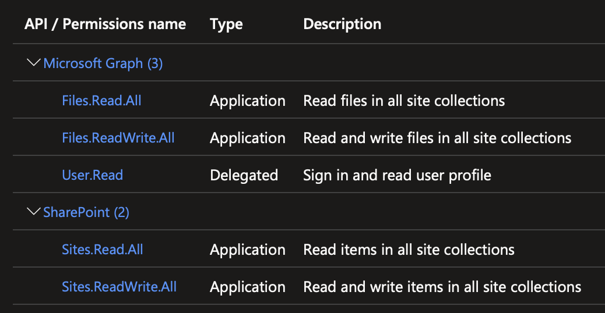

# SharePoint Online Git Repo Archive

This is a GitHub Action designed to copy an archive (`.zip`) of the given GitHub repository to SharePoint Online when a push happens. The action keeps a specified number of previous archives before beginning to prune the oldest content during each subsequent upload.

## App Registration

As described below, this action requires an application be registered in Azure AD with the appropriate permissions. Covering that process in detail is beyond the scope of this document, but it is [documented by Microsoft](https://learn.microsoft.com/en-us/azure/active-directory/develop/quickstart-register-app).

The app will need to have the following API permissions:

### Microsoft Graph

- `Files.Read.All`
- `Files.ReadWrite.All`
- `User.Read`

### SharePoint

- `Sites.Read.All`
- `Sites.ReadWrite.All`

## Inputs

The following inputs are required, though many have default values as specified here. It's recommended to use GitHub Actions Secrets to store them safely, especially the secret:

- `tenant_id`: ID for the Office 365 tenant.
- `aad_endpoint`: URL for the Azure AD endpoint. Defaults to: `https://login.microsoftonline.com`
- `graph_endpoint`: URL for the Microsoft Graph endpoint. Defaults to: `https://graph.microsoft.com`
- `spo_path`: Path to the site collection and directory where the archives should be written. E.g.: `/v1.0/drives/{site_collection_id}/root:/{directory_name}`
- `client_id`: Client ID for the application registered in Azure AD.
- `client_secret`: Client secret for the application registered in Azure AD.
- `base_name`: Name to prefix each `.zip` file with. Defaults to the name of the repository against which the action is running.
- `archive_count`: Number of total archives to keep in the directory. Defaults to `4`.
- `directory_path`: Path to be zipped for the archive. Defaults to the current repository's workspace.
- `logging`: Log level to output. Must be one of `DEBUG`, `INFO`, `WARNING`, or `ERROR`. Defaults to `INFO`.
